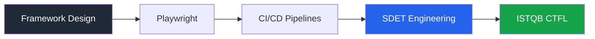

<div align="center">

# Umar Ahamed

### Aspiring QA Automation Engineer • SDET • Software Engineering Undergraduate

<p>
  Building scalable automation systems with a software engineering mindset.
</p>

<br>

<a href="https://linkedin.com/in/ahamed-umar">
  
</a>

<a href="mailto:aamedumar825@gmail.com">
  
</a>


</div>

---

# About Me

```ts
const umar = {
  role: "QA Automation Engineer",
  specialization: "Test Architecture & Automation",
  
  philosophy: [
    "Automation is engineering, not scripting",
    "Reliable tests > large test suites",
    "Maintainability scales quality"
  ],

  currentFocus: [
    "Playwright Automation",
    "Framework Architecture",
    "CI/CD Pipelines",
    "Scalable Test Design",
    "SDET Engineering Practices"
  ]
};
```

---

# Engineering Mindset

I approach QA Automation as a software engineering discipline — focused on architecture, reliability, maintainability, and long-term scalability.

### Core Principles

- Designing maintainable automation frameworks
- Reducing flaky tests through clean architecture
- Writing reusable and scalable test utilities
- Integrating automated testing into CI/CD pipelines
- Prioritizing stability over inflated coverage metrics

---

# Tech Stack

<div align="center">

## Automation & Testing


<br>


---

## Tools & DevOps


</div>

---

# Testing Methodologies

```text
✔ Page Object Model (POM)
✔ Behavior Driven Development (BDD)
✔ API Testing & Validation
✔ End-to-End Automation
✔ Cross Browser Testing
✔ CI/CD Integrated Testing
```

---

# Current Roadmap



- Framework architecture refinement
- Playwright advanced automation
- CI-integrated execution pipelines
- Java mastery for enterprise SDET roles
- Preparing for ISTQB CTFL certification

---

# GitHub Analytics

<div align="center">


<br><br>


</div>

---

# Achievements

<div align="center">


</div>

---

# Open To

<div align="center">

`QA Automation Opportunities` • `SDET Roles` • `Open Source Collaboration`

`Framework Design Discussions` • `Mentorship` • `Tech Networking`

</div>

---

# Connect With Me

<div align="center">

<a href="https://linkedin.com/in/ahamed-umar">
  
</a>

<a href="mailto:aamedumar825@gmail.com">
  
</a>


</div>

---

<div align="center">

### "Quality is engineered — not inspected."

<br>

⭐ If you enjoy my work, consider starring my repositories.

</div>
