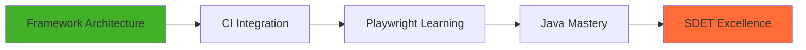

<div align="center">

# 👋 Hi, I'm Umar Ahamed

### Software Engineering Undergraduate | QA Automation Engineer | SDET

[](https://linkedin.com/in/ahamed-umar)
[](mailto:aamedumar825@gmail.com)
[](https://drive.google.com/file/d/1hyHbk9JkrvgtlFYKzllNbVSqpLnhGXpQ/view)


</div>

---

## 🎯 About Me

```typescript
const umar = {
    role: "QA Automation Engineer",
    focus: "Building reliable automation systems",
    philosophy: "Automation is engineering — not scripting",
    currentlyWorkingOn: [
        "Designing scalable automation frameworks",
        "Improving test architecture & maintainability",
        "Reducing flaky tests through better structure"
    ]
};
```

<details>
<summary>📊 <b>More About My Approach</b></summary>
<br>

I treat test automation as a software engineering discipline:
- ✅ Writing maintainable, scalable test code
- 🏗️ Building robust framework architectures
- 🔄 Implementing CI/CD integration
- 📈 Focusing on test reliability over coverage numbers

</details>

---

## 🛠️ Tech Stack

<table>
<tr>
<td valign="top" width="50%">

### 🧪 Automation & Testing


**Methodologies:**
- Page Object Model (POM)
- Behavior Driven Development (BDD)
- API Testing & Validation

</td>
<td valign="top" width="50%">

### 💻 Languages & Tools


**Build & CI/CD:**
- Maven
- Git & GitHub
- Jenkins
- Docker
- Linux

</td>
</tr>
</table>

---

## 🎯 Current Focus



- 🏗️ Framework architecture refinement
- 🔄 CI-integrated test execution
- 🎭 Playwright fundamentals
- ☕ Strengthening Java for SDET roles

---

## 🚀 Upcoming Projects

<table>
<tr>
<td width="50%">

### 🎯 Automation Framework Design
[](https://github.com/ahamedumar15/YOUR_REPO)

**Selenium + Cucumber + TestNG Framework**

```
✓ Modular POM architecture
✓ Reusable step definitions
✓ Integrated reporting
✓ CI-compatible execution
✓ Data-driven testing support
```

**Tech:** `Selenium` `Cucumber` `TestNG` `Maven` `Jenkins`

</td>
<td width="50%">

### 📋 Manual Testing & Defect Management
[](https://github.com/ahamedumar15/YOUR_REPO)

**Comprehensive Test Strategy**

```
✓ Complete test plan documentation
✓ 35+ structured test cases
✓ Defect lifecycle tracking
✓ Priority classification strategy
✓ Test metrics & reporting
```

**Focus:** `Test Planning` `Bug Tracking` `Documentation`

</td>
</tr>
</table>

<div align="center">

### 📂 [View All Projects →](https://github.com/ahamedumar15?tab=repositories)

</div>

---

## 📊 GitHub Stats

<div align="center">


</div>

<div align="center">

[](https://git.io/streak-stats)

</div>

---

## 🏆 Achievements & Contributions

<div align="center">

[](https://github.com/ryo-ma/github-profile-trophy)

</div>

---

## 💡 Testing Philosophy

<div align="center">

```ascii
╔═══════════════════════════════════════════════════════════╗
║                                                           ║
║   "Quality is engineered. Reliability is intentional."   ║
║                                                           ║
║         Testing is not just finding bugs —               ║
║         it's preventing them through better design       ║
║                                                           ║
╚═══════════════════════════════════════════════════════════╝
```

</div>

---

## 📫 Let's Connect!

<div align="center">

I'm always open to discussing test automation, framework design, or SDET career paths!

[](https://linkedin.com/in/ahamed-umar)
[](mailto:aamedumar825@gmail.com)
[](https://drive.google.com/file/d/1hyHbk9JkrvgtlFYKzllNbVSqpLnhGXpQ/view)

### 🤝 Open to:
`Collaboration` • `Mentorship` • `Code Reviews` • `Tech Discussions` • `Job Opportunities`

</div>

---

<div align="center">

### ⭐ If you find my work valuable, consider giving my repos a star!

**💼 Currently seeking SDET/QA Automation opportunities**

---

*Last Updated: February 2026*


</div>
